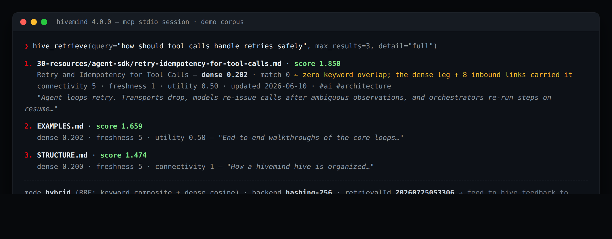
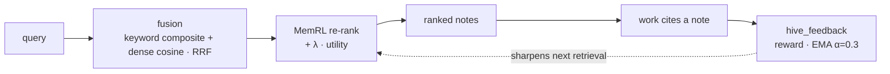
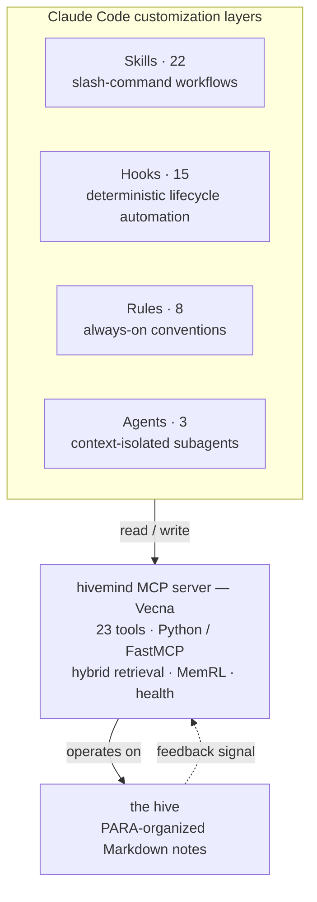
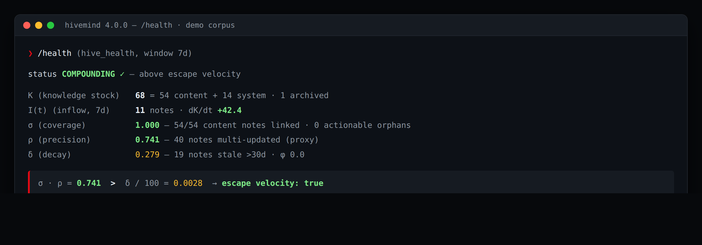

<div align="center">


<p><em>One shared network linking every note, every decision, every session into a single superorganism.<br>Turn an AI coding agent's transient context into a durable, self-improving knowledge base.</em></p>

[](https://github.com/alexiagnocco/hivemind/actions/workflows/ci.yml)
[](LICENSE)


[](https://alexiagnocco.github.io/hivemind/)

**[Enter the hive — read the documentation site&nbsp;→](https://alexiagnocco.github.io/hivemind/)**

</div>

---

## What you get in 60 seconds

- **A working memory layer for an AI coding agent** — a Python/FastMCP MCP server (23 tools, 207 tests) that any MCP client can load.
- **Retrieval that learns**: keyword + dense-vector fusion (Reciprocal Rank Fusion), re-ranked by a reinforcement-learning utility signal that rewards the notes actually *cited* in later work.
- **A full agent-behavior stack**: 22 skills, 15 hooks, 8 rules, and 3 subagents that make the agent retrieve before acting, persist while working, and extract learnings after.
- **A five-minute demo**: clone → open in Claude Code → ranked retrieval, knowledge-health metrics, and cross-domain synthesis over a seeded 53-note corpus, no external services required.



---

hivemind is a self-contained piece of **agent-platform infrastructure**: the memory and context layer that makes an AI coding agent measurably better with use. A Python MCP server does **hybrid retrieval with a reinforcement-learning feedback loop**; a layered stack of skills, hooks, rules, and subagent patterns makes the agent *retrieve before it acts, persist as it works, and learn what was actually useful*; and the whole loop is instrumented — retrieval coverage, precision, and knowledge health are measured quantities here, not vibes. It runs on any MCP client.

The theme is the hive mind of *Stranger Things*: a single psychic network linking every node into one organism. Here the nodes are Markdown notes, the vines are `[[wikilinks]]`, the central intelligence is the MCP server (**Vecna**, to its friends), retrieval reaches into **the Void**, and the learning loop — the part that gets sharper every time you use it — is, naturally, **Eleven**. The full naming map lives in [CLAUDE.md](CLAUDE.md).

The hive ships **seeded with a 53-note demo corpus** on agent-platform engineering — agent loop design, MCP server and gateway patterns, evaluation and observability, reliability guardrails — so retrieval ranking, the link graph, MOCs, and health metrics all demo against realistic content the moment you clone. Every seeded note is labeled `seed: demo` and disclosed as synthetic in [`30-resources/demo-corpus-readme.md`](30-resources/demo-corpus-readme.md); the corpus doubles as a readable tour of the engineering thinking behind the system itself.

The thesis in one line:

> A knowledge base compounds only when it surfaces the right things faster than it forgets them: **σ · ρ > δ / 100**.

- **σ** — retrieval *coverage*: how much of what you know you actually surface.
- **ρ** — retrieval *precision*: how useful what you surface turns out to be.
- **δ** — *decay*: how fast unused knowledge goes stale.

When `σ·ρ` exceeds `δ/100`, the system is above *escape velocity* — it accumulates useful, retrievable knowledge faster than it loses it. Every layer in hivemind exists to push one of those terms in the right direction.

> **Credit:** this compounding model — the equation, *escape velocity*, and the σ/ρ/δ terms — is adapted from [AgentOps · *The Science*](https://boshu2.github.io/agentops/the-science/) by [`boshu2`](https://github.com/boshu2/agentops) (Apache-2.0). hivemind is an independent implementation of those ideas. See [CREDITS.md](CREDITS.md).

---

## The engineering centerpiece

The retrieval engine (`hive_retrieve`) is a **two-stage hybrid ranker with a learned utility signal**:

1. **Fusion / candidacy.** Every eligible note is scored two ways at once — a keyword composite (`match·3 + freshness·2 + connectivity·1`) and dense-vector cosine similarity against a query embedding — then fused by **Reciprocal Rank Fusion** (`sum(1/(k+rank))` across both legs; the previous z-norm score fusion is retained behind `HIVEMIND_FUSION=znorm` for rollback). Because candidacy no longer requires a keyword hit, a *conceptually* relevant note with zero shared keywords still surfaces.
2. **MemRL re-ranking.** The top pool is re-ranked by a **reinforcement-learning utility signal**: `+ LAMBDA_UTILITY · zNorm(utility)`. Every time a retrieved note is later *cited* in the work, its utility is rewarded; when it's surfaced but ignored, it isn't. Utility is tracked as an exponential moving average (`α = 0.3`) per note, so the ranker continuously learns which notes are actually worth surfacing — not just which ones match the words.

This is the loop that makes the system *compound*: retrieval feeds work, work emits a feedback signal, and the signal sharpens the next retrieval.



`hive_feedback` records the reward; `hive_sigma_rho` reads the accumulated feedback back out as measured coverage/precision; `hive_health` reports whether the whole system is above escape velocity. The learning loop stays live even without Obsidian — in `fs_only` mode the filesystem is the source of truth and MemRL writes proceed.

Three retrieval refinements ride on top of the ranker:

- **Chunk granularity.** `hive_retrieve(granularity="chunk")` returns section-anchored hits with excerpts. Notes are split at heading boundaries with **Contextual Chunk Headers** (title/path/breadcrumb/tags embedded into each chunk's vector), cached incrementally in a persistent chunk index, and re-embedded only when their content or context hash changes.
- **Response projection tiers.** Every list-returning tool takes `detail: minimal|standard|full` — `minimal` costs ~30 tokens per item, `full` carries the per-component score breakdown.
- **One-shot context pack.** `hive_context` with a query returns project memory, scored top hits, the top hit's link-graph neighbors, and a logged `retrievalId` in a single ≤1200-token call — the session's first tool call can already close the MemRL loop.

Embeddings are pluggable: a dependency-free **hashing** backend (deterministic SHA-1 feature hashing, always available) or a **semantic ONNX** backend (a real sentence-transformer via `onnxruntime`). Per-note and per-chunk vectors are cached incrementally and keyed by content hash, so only changed notes re-embed.

---

## Architecture

Four composable customization layers, plus the data substrate they operate on.



| Layer | What it is | Why it's separate |
|---|---|---|
| **MCP server** (`_meta/mcp-server-py/`) | A 23-tool Python [FastMCP](https://github.com/jlowin/fastmcp) server: retrieval, link-graph, knowledge-health, and read/write tools. `HIVEMIND_PROFILE=lean` registers just the 8-tool core for token-metered clients. | Access + computation. Portable across any MCP client. |
| **Skills** (`.claude/skills/`) | Slash-command workflows (`/boot`, `/recall`, `/evolve`, `/wrap`, …) that compose the MCP tools into runbooks. | Teach the agent *how* to use the tools consistently. |
| **Hooks** (`.claude/hooks/`) | Shell scripts wired to lifecycle events (`PreToolUse`, `PostToolUse`, `Stop`, …). | Enforcement that happens *regardless* of what the model decides — e.g. blocking `rm` of an active note. |
| **Rules** (`.claude/rules/`) | Always-loaded behavioral conventions (retrieval order, frontmatter schema, nudge system). | Shape default behavior without a slash command. |
| **Agents** (`.claude/agents/`) | Subagent definitions for context-isolated fan-out (planning, research, LLM engineering). | Keep large sub-tasks out of the main context window. |

The MCP server itself is cleanly layered: a **dispatcher** routes each call to a filesystem implementation or the optional Obsidian Local REST API and degrades gracefully when REST is unavailable; a **connection monitor** tracks REST health on a background poll; a **manifest builder** maintains a metadata + link-graph index (and auto-builds it at startup on a fresh clone); a **scoring** package holds the retrieval math, embedding backends, MemRL utility, and the health equation; and a **state** layer handles incremental embedding/chunk/utility caches with atomic writes. See [`_meta/mcp-server-py/README.md`](_meta/mcp-server-py/README.md) for the module-level tour.

---

## Reference

<details>
<summary><b>The 23 MCP tools</b></summary>
<br>

**Read / Search**
| Tool | Description |
|---|---|
|hive_status|Connection status, plugin version, server health, and the active embedding backend (semantic vs lexical fallback).|
|hive_search|Search hive notes by metadata filters and/or text query. `detail: minimal\|standard\|full`.|
|hive_read|Read the full content of one or more hive notes by path.|
|hive_recent|Get notes modified in the last N days.|
|hive_related|Get bidirectional link neighbors for a note.|
|hive_manifest|Return the hive manifest index.|
|hive_rebuild|Rebuild the manifest index and pre-warm the note-embedding and chunk indexes.|
|hive_document_map|Get the heading/block/frontmatter skeleton for a note. Requires REST.|
|hive_tags|List all tags with hierarchical counts. Requires REST.|
|hive_active|Read, append to, or replace the currently-open note in Obsidian. Requires REST.|
<br>

**Retrieval + Knowledge Health**
| Tool | Description |
|---|---|
|hive_retrieve|Hybrid RRF-fused keyword + dense retrieval with MemRL re-ranking. `granularity: note\|chunk` for section-anchored hits.|
|hive_health|Compute knowledge health metrics: K, I(t), delta, sigma, rho, phi, escape velocity, dK/dt.|
|hive_context|One-shot pre-session context pack: project memory + scored hits + top-hit neighbors + a logged retrievalId.|
|hive_session_check|Post-session validation: checks that knowledge was persisted properly.|
|hive_feedback|Record whether retrieved notes were actually helpful (MemRL feedback). Works in fs_only mode.|
|hive_sigma_rho|Compute true sigma and rho from MemRL feedback data.|
|hive_prune_dryrun|Dry-run prune scan: count candidates by category without moving anything.|
|hive_unmined_sessions|Check for unmined sessions that should be processed for knowledge extraction.|
<br>

**Write**
| Tool | Description |
|---|---|
|hive_checkpoint|Mid-session incremental project memory update.|
|hive_patch|Surgical heading/block/frontmatter edit via REST PATCH. Requires REST.|
|hive_periodic|Daily/weekly/monthly/quarterly/yearly note CRUD. Requires REST.|
|hive_command|List or run Obsidian commands. Requires REST.|
|hive_open|Bring a note into focus in the Obsidian UI. Requires REST.|

The **lean profile** (`HIVEMIND_PROFILE=lean`) registers only the 8-tool core: `hive_status`, `hive_search`, `hive_read`, `hive_related`, `hive_retrieve`, `hive_context`, `hive_feedback`, `hive_rebuild`.

</details>
<br>

<details>
<summary><b>The 22 skills</b></summary>
<br>

**Session Lifecycle**
| Skill | Description |
|---|---|
|boot|Session startup: get date, load context, check health, and surface relevant knowledge — open the Gate.|
|wrap|Graceful session shutdown: retro, feedback, handoff, commit, exit — close the Gate.|
|handoff|Capture session context for continuity between sessions.|
<br>

**Retrieval & Feedback**
| Skill | Description |
|---|---|
|recall|Structured hive retrieval with relevance ranking.|
|retrieve|Composite-scored hive retrieval with MemRL utility weighting.|
|feedback|Record whether retrieved hive notes were helpful (MemRL feedback loop).|
|sigma-rho|Compute true sigma and rho from MemRL feedback data.|
<br>

**Knowledge Health**
| Skill | Description |
|---|---|
|health|Quick knowledge health metrics from the knowledge compounding equation.|
|health-check|Quick hive health scan for orphan notes, broken links, missing frontmatter, and stale content.|
|prune|Archive stale notes, clean completed items, and maintain hive scale — the remediation half of health-check.|
|link-repair|Fix broken wikilinks, link orphan notes to MOCs, and repair escape-character bugs.|
<br>

**Intelligence & Evolution**
| Skill | Description |
|---|---|
|evolve|Propose structural improvements to the hive and propagate captured learnings into operational surfaces (skills, rules, hooks).|
|connect|Find cross-domain connections and synthesis opportunities between notes.|
|think-deep|Extended reasoning for complex decisions — gathers context, reasons deeply, and persists the thinking chain.|
|weekly-review|Generate a 'State of the Hive' assessment of what's working, what's decaying, and what to do next.|
<br>

**Capture**
| Skill | Description |
|---|---|
|new-note|Create a new note with proper frontmatter, naming, and linking.|
|retro|Capture learnings and retrospectives from development work.|
|mine-sessions|Find and extract knowledge from unmined Claude Code sessions — Project NINA.|
<br>

**Engineering**
| Skill | Description |
|---|---|
|frame|Design project scaffolds, directory hierarchies, and naming conventions — or audit and reorganize existing codebases.|
|execute|Pre-task discipline for coding work: think before coding, simplicity first, surgical changes, goal-driven execution.|
|readme|Generate a comprehensive, research-backed README.md for any project by analyzing the codebase.|
|ai-engineer|LLM application playbook: RAG, agents, prompt/context engineering, tool use, structured outputs, evals. Pairs with the `ai-engineer` subagent.|

</details>
<br>

<details>
<summary><b>Embedding backends</b></summary>
<br>

| Backend | Dependencies | Notes |
|---|---|---|
| Hashing (default fallback) | none | Deterministic SHA-1 feature hashing. Always available. **Lexical, not semantic.** |
| ONNX | `embeddings` extra | Real sentence-transformer (e.g. all-MiniLM-L6-v2) via onnxruntime. **Semantic.** |

Per-note and per-chunk vectors are cached incrementally (keyed by content hash, gitignored); only changed notes re-embed.

</details>

---

## Quick start

```bash
# 1. Install the MCP server (Python 3.12 + uv)
cd _meta/mcp-server-py
uv sync --extra dev
uv run pytest -q          # 207 tests (+2 ONNX-gated skips without the embeddings extra)

# 2. (optional) point hivemind at your own hive — the launch wrapper
#    defaults HIVE_PATH to this repository, which is itself a hive
export HIVE_PATH="$HOME/my-hive"

# 3. Register the server with Claude Code
#    .mcp.json in the repo root already declares the `hivemind` server.
#    Open the repo in Claude Code and the 23 tools load automatically.
```

**Then try it on the demo corpus** (about five minutes): open the repo in Claude Code and ask for a retrieval — e.g. `hive_retrieve("how should tool calls handle retries safely")` — and you'll get ranked notes with scores and a `retrievalId`. Try `granularity: "chunk"` on the same query to get section-anchored hits. Run `/health` and you'll see the knowledge-health readout computed over the corpus, with escape velocity true. Run `/connect` to watch it generate cross-domain synthesis notes into `30-resources/synthesis/` — that folder ships empty on purpose.



The server runs **filesystem-first** — no external services required, and the MemRL learning loop stays live in pure-filesystem mode. To enable live two-way sync with Obsidian, install the [Local REST API](https://github.com/coddingtonbear/obsidian-local-rest-api) plugin and set `OBSIDIAN_API_KEY` (or store it in the OS keyring under service `hivemind`). To enable the semantic embedding backend:

```bash
cd _meta/mcp-server-py
uv sync --extra embeddings
uv run --extra embeddings python scripts/fetch-embedding-model.py
export HIVEMIND_EMBEDDINGS_BACKEND=onnx
export HIVEMIND_EMBEDDINGS_MODEL_DIR=$PWD/models/all-MiniLM-L6-v2
```

The launch wrapper auto-detects fetched weights at `models/all-MiniLM-L6-v2/`, so the two exports are only needed for a non-default location. Without weights the server boots on the dependency-free hashing backend — `hive_status` always reports which backend is live.

## Run it remotely

Open this repository in [Claude Code on the web](https://claude.ai/code) and the platform provisions itself — no local setup. A `SessionStart` hook ([`.claude/hooks/session-provision.sh`](.claude/hooks/session-provision.sh)) runs on the session's first boot:

1. **Dependencies** — `uv sync` installs the server (dev + embeddings extras).
2. **Index** — the hive manifest is built, so retrieval over the seeded corpus works from the first prompt.
3. **Embeddings** — the MiniLM ONNX weights are fetched if the environment's network policy allows; otherwise the server boots on the deterministic hashing backend. Either way `hive_status` reports the active backend — the fallback chain is itself a live demo of the backend-observability design.
4. **Smoke test** — a real JSON-RPC session is driven over stdio (initialize → tools/list → status → retrieve → health) and the verdict lands in the session context.

Then take the same five-minute path as above: ask for a retrieval over the corpus, run `/health`, run `/connect`.

A note on the smoke-test client ([`scripts/stdio-smoke.py`](_meta/mcp-server-py/scripts/stdio-smoke.py)): it holds stdin open until every expected response has been read. stdio MCP servers begin shutdown on stdin EOF and cancel in-flight tool calls, so a one-shot shell pipe (`printf ... | server`) silently drops slow calls — the failure masquerades as a broken tool. If you script your own harness against the server, keep stdin open.

---

## Repository layout

```text
hivemind/
├── .claude/
│   ├── skills/        22 slash-command workflows (+ an eval harness)
│   ├── hooks/         15 lifecycle automation scripts
│   ├── rules/         8 always-on behavioral rules
│   ├── agents/        3 subagent definitions
│   └── settings.json  wires hooks to lifecycle events
├── _meta/
│   ├── mcp-server-py/ the hivemind MCP server (Python / FastMCP, 207 tests)
│   └── scripts/       standalone hive utilities
├── docs/              the documentation website (bespoke static site → GitHub Pages)
├── .github/workflows/ CI (ruff + pytest) and Pages deploy
├── 00-inbox/ … 50-maps/   the PARA knowledge hive (seeded demo corpus)
├── memory/            project memory, glossary (seeded demo corpus)
├── .mcp.json          MCP server registration
├── CLAUDE.md          operating instructions for the agent (+ the lore naming map)
├── STRUCTURE.md       the hive layout + customization layers, explained
└── EXAMPLES.md        end-to-end session walkthroughs
```

This repository is the **engine plus a seeded demonstration hive** — the PARA folders carry the 53-note demo corpus (every file labeled `seed: demo`) so all the loops are live out of the box. To make it yours: point `HIVE_PATH` at your own hive, or write over the top of this one and delete the seeded files whenever you like — the engine does not depend on them.

## Skill evaluation

Skills are tuned against graded before/after benchmarks, not vibes. [`.claude/skills/execute-workspace/`](.claude/skills/execute-workspace/) contains a runnable harness that scores the `/execute` skill across three scenarios (ambiguous scope, over-engineering bait, a security refactor) with and without the skill loaded, so regressions in skill quality are measurable.

## Acknowledgements

hivemind's knowledge-compounding thesis — the `σ·ρ > δ/100` escape-velocity model, the σ/ρ/δ terms, the MemRL utility loop, and the 40% context rule — is **adapted from [AgentOps · *The Science*](https://boshu2.github.io/agentops/the-science/)** by [`boshu2`](https://github.com/boshu2/agentops) (Apache-2.0). hivemind contains no AgentOps code; it's an independent implementation of that model.

AgentOps synthesizes prior research that hivemind leans on directly:

- Ebbinghaus (1885), *Memory: A Contribution to Experimental Psychology* — the forgetting curve (decay).
- Darr, Argote & Epple (1995), "The Acquisition, Transfer, and Depreciation of Knowledge in Service Organizations," *Management Science* — the ~17%/week decay rate (δ).
- Liu et al. (2023), "Lost in the Middle: How Language Models Use Long Contexts," arXiv:[2307.03172](https://arxiv.org/abs/2307.03172) — long-context utilization (the 40% rule).
- "MemRL: Self-Evolving Agents via Runtime Reinforcement Learning on Episodic Memory" (2026), arXiv:[2601.03192](https://arxiv.org/abs/2601.03192) — two-phase retrieval (semantic filter → learned utility) that hivemind's fusion → MemRL re-rank mirrors.

Full attribution and the complete reference list: [CREDITS.md](CREDITS.md).

*Stranger Things* is a Netflix production; the hive-mind naming here is an affectionate fan homage, not an affiliation.

## License

[PolyForm Noncommercial 1.0.0](LICENSE) — source-available. You are welcome to read, run, study, and adapt hivemind for any noncommercial purpose: personal use, research, education, and evaluation. **Commercial use requires written permission from the author.**

> Required Notice: Copyright (c) 2026 Alex Iagnocco (https://github.com/alexiagnocco)

Repository snapshots published before 2026-07-25 carried the MIT license; from this date forward the project is licensed PolyForm Noncommercial 1.0.0.
